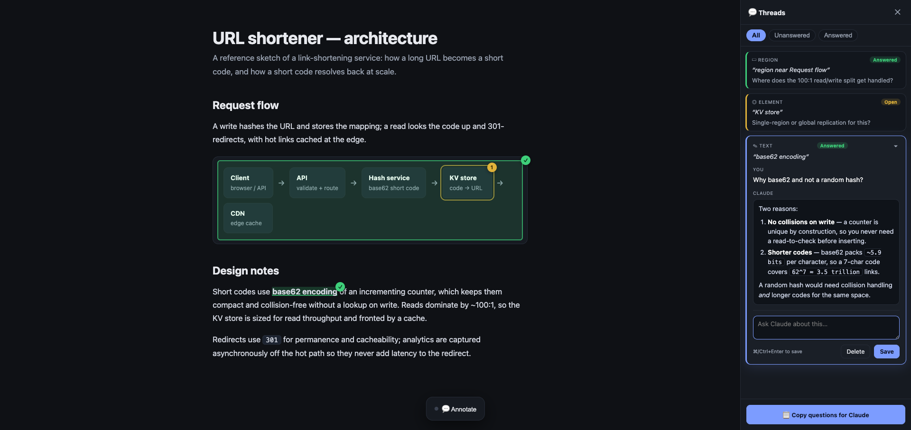

# annotatable-html

A [Claude Code](https://claude.com/claude-code) skill that turns any doc/spec/notes you ask Claude to write into a **living, annotatable web page** — highlight text, box a diagram, or click an element, pin a question to it, and Claude answers it inline. No API key, no server, no SaaS. Runs entirely on your Claude Code subscription.

Think Google Docs comments + Hypothesis highlights + Figma pins — but the replies come from Claude, and everything lives in local files you own.



*A generated architecture doc: a highlighted phrase, a dragged region box over the diagram, and an element pin on a node — each carries a threaded Q&A. Green ✓ pins are answered, amber pins are open. The sidebar shows Claude's answer rendered as markdown.*


## What you get

Ask Claude for *"a spec / notes / architecture doc on X"* and you get an HTML page with an annotation layer baked in:

- **Three ways to mark anything** — select text, press **`R`** to drag a region box over a diagram/image, or press **`E`** to click a whole block.
- **Ask questions pinned to the mark** — threads live inline in a sidebar, with filters (All / Unanswered / Answered) and amber→green ✓ pins.
- **Answers render as markdown** — headings, bold, lists, code.
- **Two answer paths, auto-picked:**
  - **Copy-paste** (works anywhere, zero setup): a button exports a self-contained batch you paste into any Claude Code chat.
  - **Auto-answer** (frictionless): double-click a launcher and questions get answered automatically via `claude -p` on your subscription — no clipboard, no reload.
- **Everything is local.** Questions live in the browser (localStorage); answers live in a plain `<name>-threads.js` file next to the doc. Nothing leaves your machine.

## Install

```
/plugin marketplace add vendz/annotatable-html
/plugin install annotatable-html@vendz
```

That's it. From then on, when you ask Claude Code for documentation/specs/notes for your own reference, it builds them as annotatable pages by default.

## Requirements

- **Claude Code** (this is a Claude Code skill).
- **A Chromium browser** (Chrome/Edge/Arc/Brave) for the auto-answer launcher; any browser works for the copy-paste path.
- **Node.js** — only for the optional auto-answer helper (`annotate-bridge.js`). The page itself needs nothing.
- The auto-answer helper uses `claude -p` on your **subscription** (no API key). It unsets `ANTHROPIC_API_KEY` for the child so it never bills the API.

## How it works

1. Claude writes `<name>.html` (with the self-mounting `annotate.js` engine) into a shared folder, `~/.claude/annotated-docs/`, plus a `<name>-threads.js` answers file.
2. You annotate in the browser; questions are saved locally.
3. **Answers:** either paste the exported batch into any Claude chat, *or* run the tiny local bridge (double-click launcher) which serves the folder and runs `claude -p` to write answers back — the page updates itself.
4. Reload (or it live-updates): pins turn green, answers appear inline.

The engine self-mounts (injects its own toolbar + sidebar, all CSS classes prefixed `az-` so it never clashes with your page) and re-locates marks across reloads by text phrase, region fractions, or element selector.

## Manual install (without the plugin system)

Copy the skill folder into your skills directory:

```bash
git clone https://github.com/vendz/annotatable-html
cp -r annotatable-html/plugins/annotatable-html/skills/annotatable-html ~/.claude/skills/
```

## License

MIT © 2026 vendz
